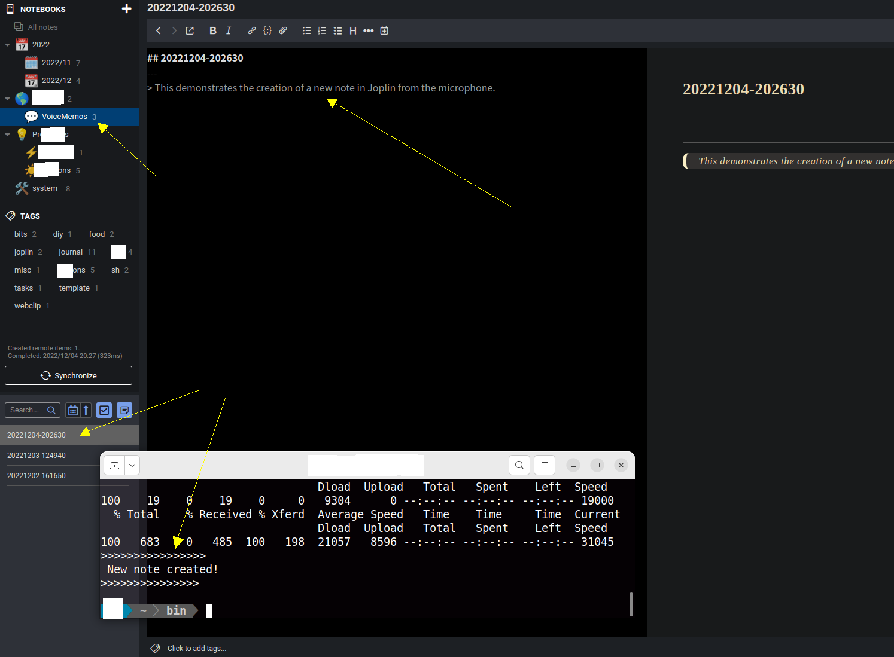

# Voice Memos to Joplin Text Notes
#### *Voice memos recorded from the microphone, transcribed offline to text and sent to the clipboard or converted to Joplin notes*
#### *Can also transcribe from an existing audio file and send text to clipboard or convert to Joplin notes*
---

#### DESCRIPTION:  
This Linux command-line utility is named **vm** for brevity and quick access from the command line (check your PATH for conflicts and rename accordingly if needed.)

**vm** utilizes previously unavailable, high-quality **offline** automatic speech recognition (ASR) technology ([Open AI's](https://openai.com/) recently open-sourced [Whisper ASR models](https://github.com/openai/whisper)) to convert user speech, such as voice memos captured from the microphone (or a pre-recorded audio file), into textual notes that are  automatically saved in the awesome, open-source, note-taking application [Joplin](https://joplinapp.org/).

As a CLI script relying on established Linux tools under the hood (*sox*, *curl*), **vm**'s feature set is exposed by a few command line arguments, but at its core it records a voice memo from the default audio input channel (microphone) or uses an audio file as the input,  transcribes it into text using [whisper.cpp](https://github.com/ggerganov/whisper.cpp) (a C/C++ port of Open AI's Whisper) and either: 
   - **sends it to the clipboard**, or
   -  **creates a new note in a running instance of the Joplin note-taking app**  using curl to access Joplin's data API (see details below)
   -   if Joplin is not running, **stores the transcription in a file for later access**. 

##### SYNOPSIS:
`vm [b|c|bc|cb|-h|help|--help|filename] ... [filename]`

 The first argument chooses one of the special-format whisper.cpp model files to use for inference.
   - `vm` the default is to use the "tiny" model file and create a note in Joplin 
   - `vm b` will transcribe to a Joplin note using the larger (more accurate but slower) "base" model
   - `vm c`  will transcribe with the default "tiny" model file but with output to the clipboard
   - `vm bc` or `vm cb` uses the "base" model file with output to the clipboard*
   -  any other 1st argument forces sox to treat it as an audio file and to try to convert it 
   - `vm x XYZ` the existence of a 2nd argument  forces sox to treat it as an audio input file
   - `vm h|help|-h|--help` will print help instructions to the standard output
      * *(tested on Ubuntu 22.04 LTS under Gnome version 42.5, with the English language models )*

##### PREREQUISITES:
* Joplin Linux desktop installation with the WebClipper plugin (see https://joplinapp.org/)   
*  Whisper.cpp installation (see https://github.com/ggerganov/whisper.cpp)
*  Recent versions of 'sox', 'curl', 'xsel' command line utilities from your system's repositories.
*  A working microphone (in GNOME one can set a keyboard shortcut to turn it ON and OFF )  

---
* Please, note that this command line utility for **Linux** is written for *zsh* but has been coded in a way that should allow it to run unmodified for users of *bash*. 
> *DISCLAIMER: Setting up the environment for this to work requires a bit of attention and, quite likely for the novice user, reading about the Linux internals and making informed choices. Some of the proposed actions, if implemented, will alter how your system works internally (e.g. systemwide temporary file storage and memory management). The author neither takes credit nor assumes any responsibility for any outcome that may or may not result from interacting with the contents of this document.*

#### Preparing the Environment
##### Temporary directory and files
*(NB. Everything in this section is based on the author's choice and opinion and may not fit the taste or the particular situation of everyone; please, adjust the script as you like. )*

Audio-to-text transcription is memory- and CPU-intensive task and fast storage for read and write access can only help. That is why **vm** is designed to store temporary and resource files in memory for speed and to reduce SSD/HDD "grinding": `TEMPD='/dev/shm'`. 
This mount point of type "tmpfs" is created in RAM (let's assume that you have enough, say, at least 8GB) and is made available by the kernel for user-space applications. When the computer is shut down it is automatically wiped out, which is fine since we do not need the intermediate files.
In fact, for Joplin and any other applications (Electron-based or not) that are stored in Appimage format, it would be beneficial (IMHO) to have the systemwide /tmp mount point also kept in RAM. Every time you start Joplin, it expands itself in /tmp writing about 500 MB to your SSD or HDD and moving /tmp to RAM may speed up application startup a bit. A welcome speedup for any Electron app.  In its simplest form, this transition is easy, just run:
`echo "tmpfs /tmp tmpfs rw,nosuid,nodev" | sudo tee -a /etc/fstab`
and then restart your Linux computer.
For the aforementioned reasons, the script also expects to find the the ASR model files needed by whisper.cpp in the same location (/dev/shm). These are large files, that can be transferred to this location at the start of a terminal session (or at system startup). This can be done using your .zshrc (or .bashrc) file by placing something like this in it: 
`([ -f /dev/shm/ggml-tiny.en.bin ] || cp /path/to/your/local/whisper.cpp/models/ggml* /dev/shm/)`

##### "Installation"
Place the main script **vm** somewhere in your PATH. Also create a symbolic link (in your PATH) to the compiled "main" executable in the whisper.cpp directory. For example, create it in your $HOME/bin> with `ln -s /full/path/to/whisper.cpp/main $HOME/bin/transcribe`. 

If you are using the GNOME integration (recommended), don't forget to:
* Place `Whispers.desktop` in `$HOME/.local/share/applications/
* Move the icon referenced in the .desktop file to the specified directory in $HOME/.local/...
* Find "Whispers" in your Activities and click "Add to Favorites" to pin it to the dock
* Create a new profile in gnome-terminal and edit it to suit your taste. Use its name in the .desktop file

##### Other environment variables

If Joplin is not running while the voice memo is being captured and transcribed, the script stores transcribed text in the Joplin configuration directory for later processing (you can change this location as needed). This is in the code: `JOPLIND=$HOME'/.config/joplin-desktop/resources' `

The next two variables are for the Joplin data API. 
The first parameter is the id of the Joplin notebook where the new note will be created.
The second is the authentication token generated by the Web Clipper plugin in Joplin. (Make sure web clipper is installed, the token is needed to successfully interact with the REST API). 
(***Please, replace in vm with your own values from the Joplin desktop app for Linux***):
In the code: `NOTEBOOK_ID="f789192ca16f7848b9a7a5a80a2f51bdde"`  and `AUTH_TOKEN="cd45de696edd929af03ef8a828bf3f3f23f63f586827176fd66f4750ac07446af0f772e06b5829b4bde28e8a87c210d9549b9569"`

##### Partial Code (full script in vm):

```bash
#!/usr/bin/zsh
# Should work also for users of bash, replace the above shebang with the path to 'bash'

# MIT License

# Copyright (c) 2022 Quantius Benignus

# Permission is hereby granted, free of charge, to any person obtaining a copy
# of this software and associated documentation files (the "Software"), to deal
# in the Software without restriction, including without limitation the rights
# to use, copy, modify, merge, publish, distribute, sublicense, and/or sell
# copies of the Software, and to permit persons to whom the Software is
# furnished to do so, subject to the following conditions:

# The above copyright notice and this permission notice shall be included in all
# copies or substantial portions of the Software.

# THE SOFTWARE IS PROVIDED "AS IS", WITHOUT WARRANTY OF ANY KIND, EXPRESS OR
# IMPLIED, INCLUDING BUT NOT LIMITED TO THE WARRANTIES OF MERCHANTABILITY,
# FITNESS FOR A PARTICULAR PURPOSE AND NONINFRINGEMENT. IN NO EVENT SHALL THE
# AUTHORS OR COPYRIGHT HOLDERS BE LIABLE FOR ANY CLAIM, DAMAGES OR OTHER
# LIABILITY, WHETHER IN AN ACTION OF CONTRACT, TORT OR OTHERWISE, ARISING FROM,
# OUT OF OR IN CONNECTION WITH THE SOFTWARE OR THE USE OR OTHER DEALINGS IN THE
# SOFTWARE.
#--------------------------------------------------------------------------

# NAME: vm (named for brevity and quick access, check your PATH for conflicts and rename accordingly if needed.) 
show_help() {
echo "Records a voice memo from the default input channel (microphone),"
echo " or uses an audio file as the input." 
echo "Transcribes into text using whisper.cpp (a C/C++ port of Open AI's Whisper engine)"
echo " and either:" 
echo "       - sends it to the clipboard"
echo "       - or creates a new note in a running instance of the Joplin note-taking app"
#    "         using curl to access Joplin's data API (see details below)"
echo "       - if Joplin is not running, stores the transcription in a file" 
echo -e "\n"
echo "SYNOPSIS: vm [b|c|bc|cb|help|-h|--help|filename] ... [filename]"
echo -e "\n"
#    "the first argument chooses one of the special-format whisper.cpp model files to use for inference."
echo "       - 'vm h|help|-h|--help' will print this text" 
echo "       - 'vm'   the default is to use the 'tiny' model file and create a note in Joplin" 
echo "       - 'vm b' will transcribe to a Joplin note using the larger (more accurate but slower) 'base' model"
echo "       - 'vm c' will transcribe with the default 'tiny' model file but output to the clipboard"
echo "       - 'vm bc' or 'vm cb' uses the 'base' model file and outputs to the clipboard"
echo "       - any other first argument forces sox to treat it as an audio file to be converted"
echo "       - the existence of a second argument forces sox to treat it as an audio file to be converted"
#    "(tested on Ubuntu 22.04 LTS under Gnome version 42.5 (Wayland))"
exit 0 
}
# PREREQUSITES: 
#      - Joplin desktop installation with WebClipper plugin (see https://joplinapp.org/)   
#      - whisper.cpp installation (see https://github.com/ggerganov/whisper.cpp) 
#      - recent versions of 'sox', 'curl', 'xsel' command line utilities from your system's repositories.
#--------------------------------------------------------------------------

#Check dependencies
command -v sox &>/dev/null || { echo "sox is required. Please, install sox" >&2 ; exit 1 ; }
command -v curl &>/dev/null || { echo "curl is required. Please, install curl" >&2 ; exit 1 ; }
command -v xsel &>/dev/null || { echo "xsel is required. Please, install xsel" >&2 ; exit 1 ; }
command -v transcribe &>/dev/null || { echo -e "Please, install whisper.cpp (see https://github.com/ggerganov/whisper.cpp)\
\nand create 'transcribe' in your PATH as a symbolic link to the main executable, e.g.\n \
 'ln -s /full/path/to/whisper.cpp/main \$HOME/bin/transcribe'" >&2 ; exit 1 ; }
#Hear the complaints of the above tools:
set -e

# Store temp files in memory for speed and to reduce SSD/HDD "grinding":
TEMPD='/dev/shm'
#If Joplin is not running, store transcription files in Joplin configuration directory for later processing. 
JOPLIND=$HOME'/.config/joplin-desktop/resources'  #of course you can choose another place.

# These are for the Joplin data API. 
# The first parameter is the id of the Joplin notebook where the new note will be created.
# The token is generated by the web clipper plugin in Joplin. (Make sure web clipper is installed). 
# PLEASE, REPLASE WITH YOUR OWN FROM YOUR INSTANCE OF THE JOPLIN DESKTOP APP FOR LINUX:
NOTEBOOK_ID="f5192ca16b0a2f551bdde"   # In my case the notebook is named VoiceMemos
AUTH_TOKEN="cd79de696edf3b6a0b39f78ad43f3f22c77f586827176fd66f4750ac07446af0f772e06b5827928fe1aeb6409b4bde28e81880d9549b9569"

------END of Code Snippet  (download vm for full code)
```
---
#### Notes
Sox is recording in wav format at 16k rate, the only currently accepted by whisper.cpp:
`rec -t wav $ramf rate 16k silence 1 0.1 3% 1 2.0 6% `
It will attempt to stop on silence of 2s with threshold of 6%, but you can always press CTRL-C to stop it manually. This is the only intervention that may be needed. 
After the memo is captured, it will be passed to `transcribe` i.e. whisper.cpp for speech recognition.
This will take a couple of seconds (fewer on a computer with high end CPU). The default number of processing threads used is 4 but one can tweak that by adding  `-t n` to the command line parameters of transcribe (please, see whisper.cpp documentation) . After transcription, the text is stored in a .txt file (-otxt argument in `transcribe -m $model -f $ramf -otxt`), in this case /dev/shm/vmfile.txt . 

The script will then format the data in the appropriate format (JSON for note creation via the data API) and send it to the desired output. If note creation was requested, a check will be made whether the REST API is exposed by the Web Clipper server (i.e. Joplin is running). If not, the JSON data will be stored in a `{timestamp}.json`  file to be picked up  later by a separate script when Joplin is running.

To make interaction with this CLI utility more convenient, one can create a GNOME desktop entry (if using GNOME) with a custom profile for the terminal window (small window, custom color, transparent, etc., see `gnome-terminal` documentation on creating named profiles ) so that the window will be visible on top a maximized Joplin window. 
One can also choose whether to keep the terminal window open, or close it after the transcription (see the gnome-terminal settings for your custom profile - YOURPROFILENAME in the code below.)
Sample `Whispers.desktop` (place in your `$HOME/.local/share/applications/`):
```
[Desktop Entry]
Name=Whispers
Comment=For use with the vm CLI utility
Exec=gnome-terminal --window-with-profile=YOURPROFILENAME --hide-menubar --geometry=80x10+180+850 --title=VoiceMemo
Icon=/home/USERNAME/.local/share/icons/hicolor/128x128/apps/mic128.png
Terminal=true
Type=Application
Categories=Application
Actions=new-note;new-clip;

[Desktop Action new-note]
Name=New Joplin Note
Exec=gnome-terminal --window-with-profile=YOURPROFILENAME --hide-menubar --geometry=80x10+180+850 --title=NewNote -- vm

[Desktop Action new-clip]
Name=Record To Clipboard
Exec=gnome-terminal --window-with-profile=YOURPROFILENAME --hide-menubar --geometry=80x10+180+850 --title=NewClip -- vm c

```
With the above `gnome-terminal` desktop entry ( please, adjust profile and username), the  utility will be accessible from the system dock, after you add it to your "Favorites" (right mouse click brings up the shown context menu):

> 
The desktop entry is set so that just clicking on the dock icon with the left mouse button will open the terminal and wait for the **vm** command, while invoking one of the context menu commands will immediatlely start recording and will close the window when finished transcribing.

If using X11 (instead of the restrictive Wayland), one can use the `--geometry` command line argument to position the small terminal window  in front of a dead space in the Joplin window and set it to stay on top (screenshots):

> 


> 

Even with the default "tiny" model, the accuracy  (English language tested) is impressive and on a faster computer (not mine) it takes less than a second to transcribe a 30s audio clip with essentially no errors.
As such, this command-line utility, combined with the strength of the now open-sourced [Whisper](https://github.com/openai/whisper) from Open AI (its [whisper.cpp](https://github.com/ggerganov/whisper.cpp) port, to be more precise), proves quite useful and practical, especially in the context of a note-taking app such as the versatile, customizable [Joplin](https://joplinapp.org/). Enjoy!

2022/12/05 
